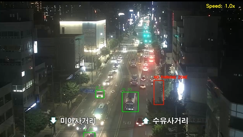
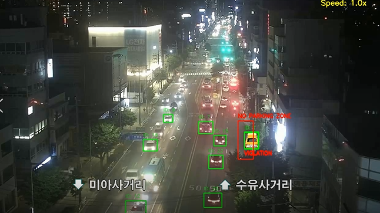
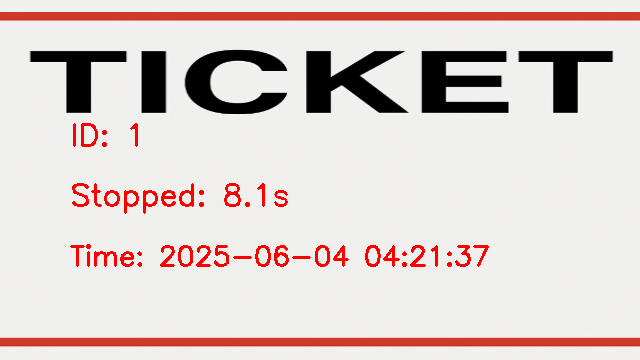

# 🚗 AutoFine AI

**불법 주정차 감지 및 AI 기반 자동 신고 시스템**

---

## 프로젝트 개요

AutoFine AI는 도로 위 **불법 주정차 차량을 자동 감지**하고, 차량 정보 및 정차 시간, 침범률 등을 기반으로 **위반 레벨을 판단**, **과태료 티켓을 자동 생성**하는 시스템입니다.

이 시스템은 행정 처리와 도시 교통 질서 개선을 위한 도구로 사용될 수 있습니다.

---

## 핵심 기능

- **YOLOv8 차량 감지** + **ByteTrack 객체 추적**
- ROI 기반 **위반 구역 감지**
- 정차 시간 기준 위반 여부 판단
- 차량 번호판 인식 (OCR) + 차종 분류 (CNN)
- **티켓 이미지 자동 생성**

---

## 프로젝트 구조
```
AutoFineAI/
├── ByteTrack/ # 추적 알고리즘 서브모듈
├── data/
│ ├── cctv.mp4 # 테스트용 CCTV 영상 (일반)
│ ├── cctv_with_car.mp4 # 차량 포함 시뮬레이션 CCTV 영상
│ ├── output_no_video.mp4 # 정상 주정차 영상 출력 예시
│ ├── output_yes_video.mp4 # 위반 주정차 영상 출력 예시
│ ├── ticket_template.png # 티켓 생성용 템플릿
│ └── 기타 리소스 이미지
├── tickets/
│ ├── ticket_ex.png # 티켓 출력 예시 이미지
│ └── ticket_*.png # 실제 실행 시 생성되는 티켓들
├── main.py # 메인 실행 파일
├── detector.py # YOLO 기반 차량 탐지 모듈
├── tracker.py # ByteTrack 추적 모듈
├── violation_checker.py # 정차 시간 및 ROI 체크
├── ticket_generator.py # 티켓 이미지 생성
├── click_roi_selector.py # ROI 구역 설정 GUI
├── car_num.py # 자동차에 번호판 합성
├── car_simulation_creator.py # CCTV 영상에 차량 합성 시뮬레이터
├── yolov8n.pt # YOLOv8 모델 파일
└── requirements.txt # 필요 라이브러리 목록
```
--- 

## ▶️ 실행 방법

1. 가상환경 활성화 후 필요한 라이브러리 설치:
pip install -r requirements.txt

2. ROI(금지 구역) 설정
python click_roi_selector.py
→ 영상 프레임에서 마우스로 금지 구역을 지정한 뒤 저장. 이 과정은 최초 한 번만 수행하면 됩니다.

3. 메인 시스템 실행
python main.py
→ 영상이 재생되며, 위반 차량이 감지되면 tickets/ 폴더에 티켓이 자동 저장됩니다.

---

## 출력 영상 예시
<table>
  <tr>
    <th>정상 주정차 (output_no_video.mp4)</th>
    <th>위반 주정차 (output_yes_video.mp4)</th>
  </tr>
  <tr>
    <td>
      <a href="data/output_no_video.mp4">
        
      </a>
    </td>
    <td>
      <a href="data/output_yes_video.mp4">
        
      </a>
    </td>
  </tr>
</table>

--- 

## 티켓 출력 예시
출력 경로: tickets/

티켓은 위반 시 마다 자동 생성되며, 템플릿(data/ticket_template.png)을 기반으로 구성됩니다.

예시: 


## 사용 기술 스택
| 기능                  | 사용 기술                              |
|---------------------|----------------------------------------|
| 차량 탐지           | YOLOv8                                 |
| 객체 추적           | ByteTrack                              |
| 번호판 인식 (OCR)   | EasyOCR / Tesseract                    |
| 차종 분류           | ResNet 기반 CNN                        |
| 위반 판단/분석      | OpenCV, ROI 매칭, 시간 계산            |
| 티켓 생성           | PIL, 이미지 처리                       |
| 통계/시각화         | Matplotlib, SQLite 또는 CSV            |


## 작성일
2025년 5월 30일
