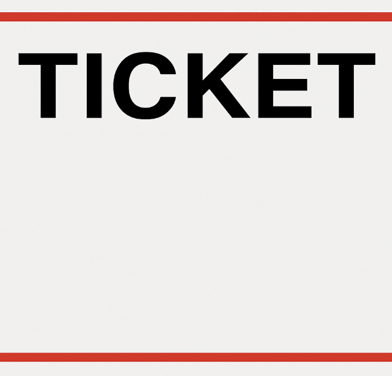

# AutoFine AI

**불법 주정차 감지 및 AI 기반 자동 신고 시스템**

---

## 프로젝트 개요

AutoFine AI는 도로 위 **불법 주정차 차량을 인공지능으로 자동 감지**하고, 차량의 **정차 시간**과 **위반 구역 침범 여부**를 분석하여 **과태료 티켓을 자동 생성**하는 시스템입니다.

도시 내 불법 주정차 문제는 긴급차량 통행 방해, 교통 흐름 저해, 보행자 안전 위협 등 다양한 사회적 비용을 유발하고 있음에도 불구하고, 단속 인력과 자원의 부족으로 인해 실시간 관리가 어려운 상황입니다. 이에 따라 본 프로젝트는 **영상 기반의 자동 감지 시스템을 통해 단속 효율성을 높이고**, **정량적 근거에 기반한 과태료 부과 자동화**를 실현하는 것을 목표로 합니다.

특히 행정 자동화 측면에서 반복 위반 차량이나 특정 시간대 집중 단속 등의 기능으로 정책적 대응을 강화할 수 있으며, 추후 확장 가능성도 고려하여 구조화된 시스템으로 설계되었습니다.

> 본 프로젝트에서 사용하는 CCTV 영상은 **도로교통공단에서 제공하는 실시간 스트리밍을 기반으로 FFmpeg를 활용해 1분간 녹화**한 영상입니다.  
> 또한, 실제 주정차 장면이 포함되지 않은 CCTV 영상에 대해 **임의의 불법주정차 구역(ROI)을 지정하고, 해당 위치에 차량을 합성하여 테스트용 시뮬레이션 영상을 생성**하여 진행하였습니다. 

---

## 핵심 기능

- **YOLOv8 차량 감지** + **ByteTrack 객체 추적**
- ROI 기반 **위반 구역 감지**
- 정차 시간 기준 위반 여부 판단
- **티켓 이미지 자동 생성**

--- 

## 실행 방법

1. 가상환경 활성화 후 필요한 라이브러리 설치:
```bash pip install -r requirements.txt```

2. ROI(불법 주정차 금지 구역) 설정:
```bash python click_roi_selector.py```
→ 영상 프레임에서 마우스로 금지 구역을 지정한 뒤 저장. 이 과정은 최초 한 번만 수행하면 됩니다.

3. 메인 시스템 실행:
```bash python main.py ```
→ 영상이 재생되며, 위반 차량이 감지되면 tickets/ 폴더에 티켓이 자동 저장됩니다.

---

## 데모 시나리오

1. 사용자가 CCTV 영상에서 ROI(불법 주정차 금지 구역)를 지정한다.
2. 차량이 해당 구역에 일정 시간 이상 정차하면 시스템이 이를 자동 감지한다.
3. 감지된 차량의 정차 시간과 침범 위치를 분석하여 위반 여부를 판단한다.
4. 정차 시간이 **3초 이상일 경우 경고 메시지**, **8초 이상일 경우 불법 주정차 메시지**를 출력한다.
5. 위반 차량에 대해 티켓 이미지를 자동 생성하여 저장한다.

---

## 출력 영상 예시
<table>
  <tr>
    <th>정상 주정차 (output_no_video.mp4)</th>
    <th>위반 주정차 (output_yes_video.mp4)</th>
  </tr>
  <tr>
    <td>
      <a href="data/output_no_video.mp4">
        
      </a>
    </td>
    <td>
      <a href="data/output_yes_video.mp4">
        
      </a>
    </td>
  </tr>
</table>

--- 

## 티켓 출력 예시

- **출력 위치**: `tickets/` 폴더  
- **생성 시점**: 불법 주정차 위반이 감지될 때마다(주청자구역에 8초 이상 주차 시) 자동 생성  
- **저장 형식**: `.png` 이미지  
- **기반 템플릿**: `data/ticket_template.png`

각 티켓은 다음 정보를 포함하여 시각적으로 정리된 형태로 출력됩니다:
- 차량 ID  
- 정차 시간  
- 위반 발생 시간  

| 템플릿 이미지 | 생성된 티켓 예시 |
|:--:|:--:|
|  |  |


---

## 참고 및 라이선스

- YOLOv8: [https://github.com/ultralytics/ultralytics](https://github.com/ultralytics/ultralytics)
- ByteTrack: [https://github.com/ifzhang/ByteTrack](https://github.com/ifzhang/ByteTrack)
- 본 프로젝트는 학술 목적/공공 목적의 테스트용으로 개발됨.

---

## 프로젝트 구조
```
AutoFineAI/
├── ByteTrack/ # 추적 알고리즘 서브모듈
├── data/
│ ├── cctv.mp4 # 테스트용 CCTV 영상 (일반)
│ ├── cctv_with_car.mp4 # 차량 포함 시뮬레이션 CCTV 영상
│ ├── output_no_video.mp4 # 정상 주정차 영상 출력 예시
│ ├── output_yes_video.mp4 # 위반 주정차 영상 출력 예시
│ ├── ticket_template.png # 티켓 생성용 템플릿
│ └── 기타 리소스 이미지
├── tickets/
│ ├── ticket_ex.png # 티켓 출력 예시 이미지
│ └── ticket_*.png # 실제 실행 시 생성되는 티켓들
├── main.py # 메인 실행 파일
├── detector.py # YOLO 기반 차량 탐지 모듈
├── tracker.py # ByteTrack 추적 모듈
├── violation_checker.py # 정차 시간 및 ROI 체크
├── ticket_generator.py # 티켓 이미지 생성
├── click_roi_selector.py # ROI 구역 설정 GUI
├── car_num.py # 자동차에 번호판 합성
├── car_simulation_creator.py # CCTV 영상에 차량 합성 시뮬레이터
├── yolov8n.pt # YOLOv8 모델 파일
└── requirements.txt # 필요 라이브러리 목록
```

--- 

## 프로젝트 정보

- 작성일: 2025년 5월 30일    
- 환경: Python, OpenCV, FFmpeg  

